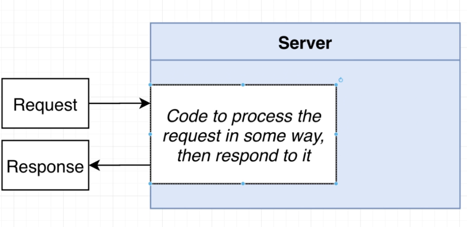
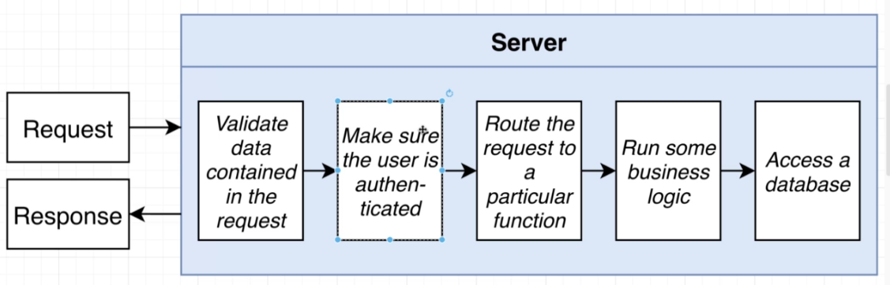
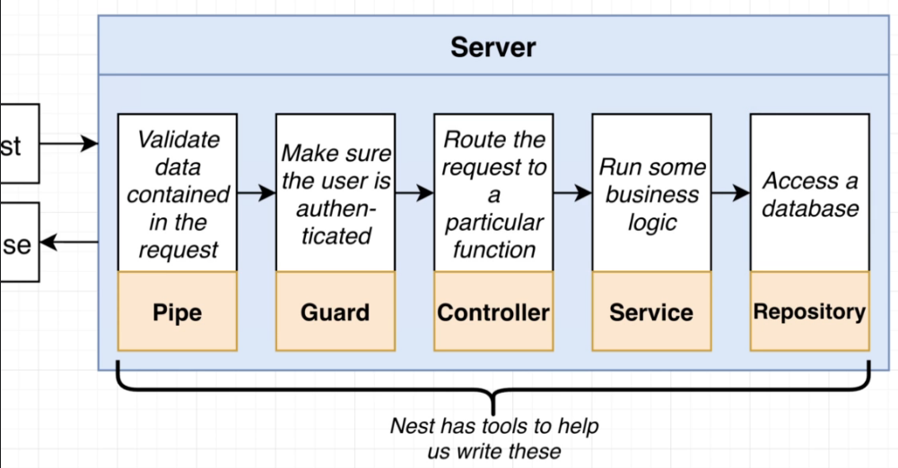
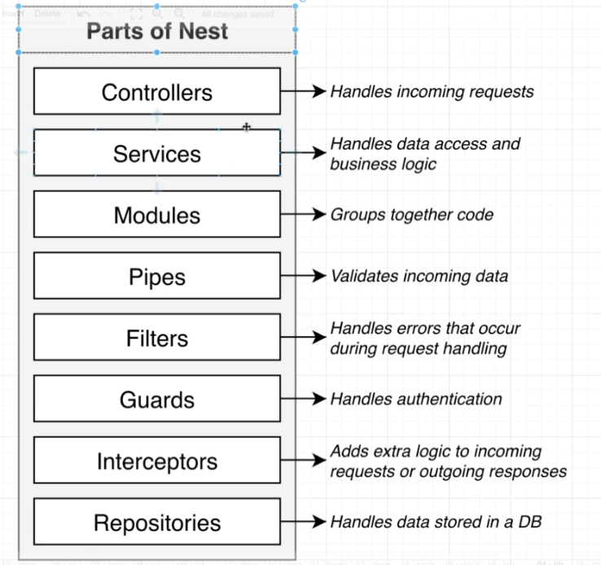
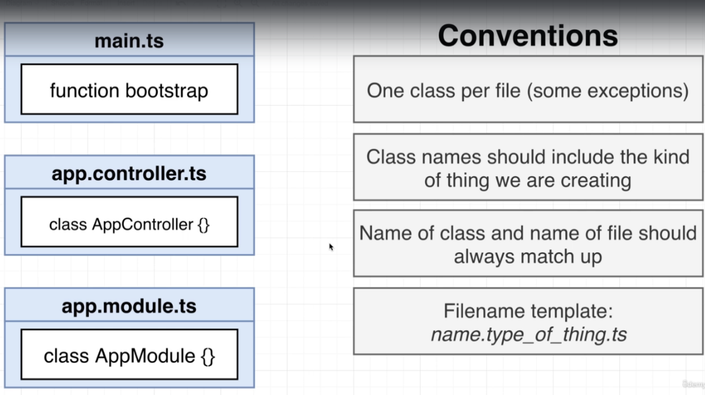

# Setting up nestjs manually
NESTJS can be easily setup using nest CLI. The Nest CLI is a command-line interface tool that helps you to initialize, develop, and maintain your Nest applications. It assists in multiple ways, including scaffolding the project, serving it in development mode, and building and bundling the application for production distribution. It embodies best-practice architectural patterns to encourage well-structured apps.

I have set up nestjs Manually here with the steps mentioned below, so that we are not overwhelmed by the scaffolded code and structure.

### Install
```
npm init -y
npm install @nestjs/common@7.6.17 @nestjs/core@7.6.17  @nestjs/platform-express@7.6.17 reflect-metadata@0.1.13 typescript@4.3.2
```
#### What are we installing?
1. @nestjs/common - contains functions classes needed from nest
2. @nestjs/platform-express - Lets you use express js for http layer (or You can use fastify)
3. reflect-metadata - Helps to make decorators work
4. typescript - use typescript

### configure typescript compiler
1. create a file tsconfig.json on the root of the directory
2. add following code to it:
```
{
  "compilerOptions": {
    "module": "CommonJS",
    "target": "ES2017",
    "experimentalDecorators": true,
    "emitDecoratorMetadata": true
  }
}


```


### create module and a controller
###### How controllers work in Nest:


1. create a `main.ts` file in the `src` folder
2. add follwoing code:
```
import {Controller, Module, Get} from "@nestjs/common";
import {NestFactory} from "@nestjs/core";

@Controller()
class AppController {
    @Get()
    getRootRoute(){
        return 'hi there!';
    }
}

@Module({
    controllers:[AppController]
})
class AppModule{}

async function bootstrap() {
    const app = await NestFactory.create(AppModule)
    await app.listen(3000)
}
bootstrap()
```

###### General Nestjs Application steps


###### tools that nestjs provides


###### Parts of Nestjs



#### Run
1. `npx ts-node-dev src/main.ts`
2. open the browser to run `http://localhost:3000/`

#### Refactoring

###### General File Naming convention NEstjs


1. Create `app.module.ts` and `app.controller.ts` files
2. move the code related to controller to app.controller.ts
```
import {Controller, Get} from "@nestjs/common";

@Controller()
export class AppController {
    @Get()
    getRootRoute() {
        return 'hi there!';
    }
}

```

3. move the code related to Module to app.module.ts and add necessary import
```  
import {Module} from "@nestjs/common";
import {AppController} from "./app.controller";

@Module({
    controllers:[AppController]
})
export class AppModule{}
```
4. `main.ts would look like:

``` 
import {NestFactory} from "@nestjs/core";
import {AppModule} from "./app.module";


async function bootstrap() {
    const app = await NestFactory.create(AppModule)
    await app.listen(3000)
}

bootstrap()
```
#### Routing
1. if we want to have routes like /app/hi and /app/bye we can go in app.controller.ts and add `@Controller('/app')`
2. @Get('h1') in get decorator
3. to have `/app/bye` add following code with another decorator:
``` 
    @Get('bye')
    getByeThere(){
        return 'bye there!'
    }
 ```